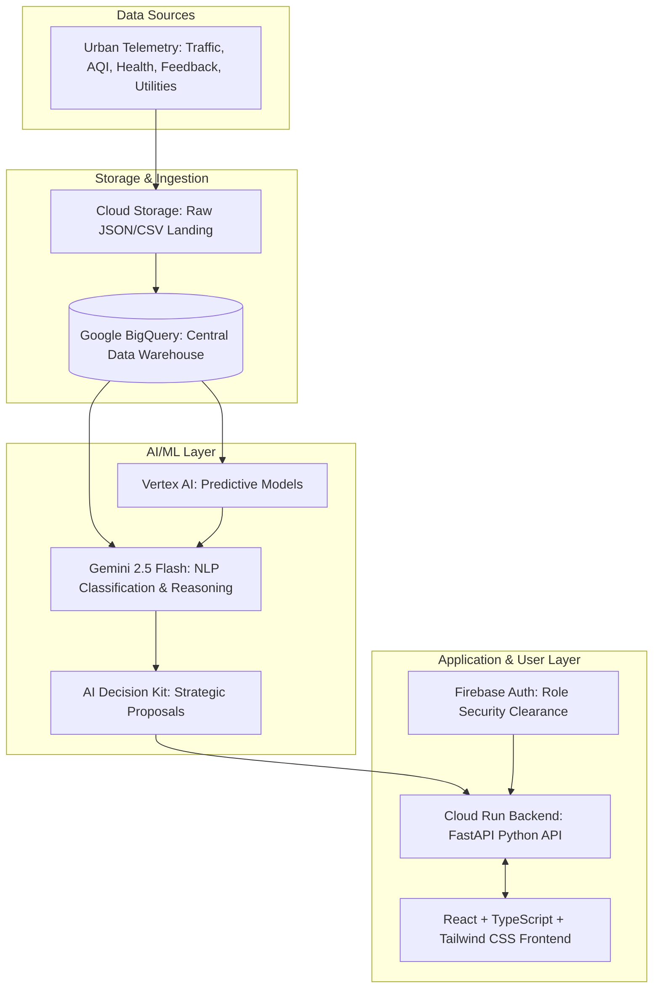

# CivicMind AI
> **Turning Community Data into Smart Decisions**

CivicMind AI is a Decision Intelligence Platform built for the Google Cloud Gen AI Academy APAC Edition Hackthon. It consolidates siloed urban data streams—traffic sensors, air quality meters, public health records, utility loads, and citizen feedback portals—into an AI-augmented administrative dashboard.

---

## 🏛️ System Architecture



---

## 🚀 Key Features

*   **Real-Time Geographic Dashboard:** Interactive Leaflet maps rendering toggleable traffic congestion lines, regional PM2.5 pollution circles, healthcare indicators, and active alert hotspots.
*   **Gemini-Powered Chatbot:** Context-aware natural language assistant for querying municipal metrics, retrieving predictions, and auditing datasets.
*   **Predictive Analytics:** 24-hour predictive intervals (traffic and PM2.5 levels) visualised with upper and lower confidence limit bands, alongside seasonal health case forecasts.
*   **AI Complaint Intake & Dispatch:** Real-time analysis of citizen feedback that automatically determines category, priority, sentiment, and drafts an executive brief.
*   **AI Report Workshop:** Instantly translates current city indicators and Gemini strategic recommendations into styled briefing reports downloadable as PDFs.
*   **Workflow Automation:** Local task tracking queues that assign action tasks to specific departments, updateable through REST APIs.

---

## 🛠️ Tech Stack

*   **Frontend:** React (Vite, TypeScript), Tailwind CSS, Framer Motion, Recharts (visual plotting), Leaflet & React-Leaflet (mapping).
*   **Backend:** FastAPI (Python), Uvicorn, ReportLab (PDF compilation), Pydantic.
*   **AI & Databases:** Google Gen AI SDK (`gemini-2.5-flash`), Firebase Auth, Firestore, Google BigQuery.

---

## 📂 Folder Structure

```text
├── backend/
│   ├── app/
│   │   ├── api/          # FastAPI routers (auth, metrics, chatbot, reports, etc.)
│   │   ├── core/         # Settings parsing via Pydantic
│   │   ├── data/         # Time-series datasets & mock simulation engines
│   │   ├── services/     # PDF generator, Gemini interfaces, forecast engines
│   │   └── main.py       # FastAPI application entry point
│   ├── Dockerfile
│   └── requirements.txt  # Python packages
├── frontend/
│   ├── src/
│   │   ├── components/   # Reusable UI widgets (Sidebar, Navbar, LeafletMap, ChartContainer)
│   │   ├── context/      # Theme, localization (English/Hindi/Marathi), and Auth states
│   │   ├── pages/        # Dashboard layout pages (Landing, Login, Feedback, Reports, etc.)
│   │   ├── utils/        # Fetch API wrapper
│   │   ├── App.tsx       # Main routing core
│   │   └── index.css     # CSS, Tailwind imports, and dark-mode tile overrides
│   ├── package.json
│   └── Dockerfile
├── docker-compose.yml    # Root multi-container orchestration
└── README.md
```

---

## ⚡ Local Setup & Execution

### Option A: Using Docker (Recommended)
Launch both services with a single command from the project root directory:
```bash
docker compose up --build
```
*   **Frontend UI:** `http://localhost` (Served via Nginx)
*   **FastAPI API:** `http://localhost:8000`
*   **Swagger Docs:** `http://localhost:8000/docs`

### Option B: Manual Startup

#### 1. Start Backend (FastAPI)
```bash
cd backend
python -m venv .venv
source .venv/bin/activate  # Or `.venv\Scripts\activate` on Windows
pip install -r requirements.txt
uvicorn app.main:app --port 8000 --reload
```

#### 2. Start Frontend (React + Vite)
```bash
cd frontend
npm install
npm run dev
```
*   The Vite server will start on `http://localhost:5173`.

---

## ☁️ Google Cloud Services Deployment Guide

### 1. BigQuery Setup
Create a dataset named `city_telemetry` and set up telemetry schemas matching the mock datasets:
```sql
CREATE OR REPLACE TABLE `your_project.city_telemetry.traffic_congestion` (
  timestamp TIMESTAMP,
  congestion FLOAT64,
  average_speed FLOAT64,
  street_name STRING
);
```

### 2. Vertex AI API Activation
Activate the Vertex AI API in your Google Cloud Console. The forecasting charts map parameters representing predictions generated by Vertex Time Series Forecasting models (e.g., trained on historical traffic volumes).

### 3. Firebase Authentication configuration
1.  Go to the Firebase Console and create a project linking your GCP ID.
2.  Enable the **Email/Password** and **Google** Sign-In providers in Authentication.
3.  Inject the Firebase SDK parameters inside the React context to switch from mock authentication to real Google authentication.

### 4. Deploying to Google Cloud Run
Build and push both images to Google Artifact Registry, then launch on Cloud Run:

#### Deploy Backend
```bash
cd backend
gcloud builds submit --tag gcr.io/your_project/civicmind-backend
gcloud run deploy civicmind-backend \
  --image gcr.io/your_project/civicmind-backend \
  --platform managed \
  --region us-central1 \
  --allow-unauthenticated \
  --set-env-vars="GEMINI_API_KEY=your_key,GCP_PROJECT_ID=your_id"
```

#### Deploy Frontend
Update `VITE_API_URL` to point to your live Cloud Run Backend URL, then build and deploy the container:
```bash
cd frontend
gcloud builds submit --tag gcr.io/your_project/civicmind-frontend
gcloud run deploy civicmind-frontend \
  --image gcr.io/your_project/civicmind-frontend \
  --platform managed \
  --region us-central1 \
  --allow-unauthenticated
```
